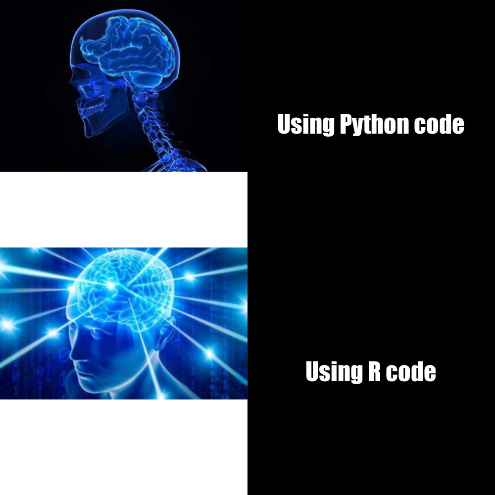

# Hello
Welcome to my Stats 220 repo for my assignment/meme

## About the meme
This meme was created using R code and the [{magick}](https://cran.r-project.org/web/packages/magick/vignettes/intro.html) package

### Origin and Creation of the meme
I am studying Computer Science at the *University of Auckland*.

Since I am studying **COMPSCI**, I am familiar with various programming languages.

The meaning behind the meme is that using R code is much more simple and easier than using Python code.

Hence, the small brain signifies Python code and the Big brain simplifies R code

